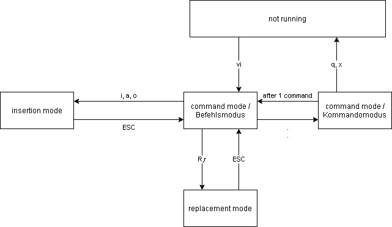

# os

## linux

### article
* [Linux in den Rechnern, Javascript in den Touchscreens - SpaceX](https://www.golem.de/news/spacex-linux-in-den-rechnern-javascript-in-den-touchscreens-2006-149084.html)

### manual
* [makefile-GNU](https://www.gnu.org/software/make/manual/make.pdf)

### vi-manual

Beginning
```bash
$ vi filename
```

after the start: **command mode**
commands are described by **1** letter  

#### insertion mode / Befehlsmodus
| commands | corresponds |  
|:---|:---|
| i: | insert at actual cursor position |   
| a: | insert after actual cursor postion |  
| o: | insert in a newl line after the actuel cursor postion |  

#### replacement mode

| command | corresponds |
|:---|:---|
| r: | one character will be overwrite **and** subsequently automatic in command mode |
| R: | At cursor postionen many characters can be overwritten |

#### command mode / Befehlsmodus

| command | corresponds |
|:---|:---|
| x: | delete actual character |
| dd: | delete actual line (1 action in the buffer. Prefix a number sia a multiplicater, e.g. 3x, 4dd |
| u: | undo last command |
| Y: | (Yank) copies current line to buffer |
| p: | insert buffer content after cursor postion **or** after actual line( if Buffer content is a hole line) |
| P: | like p, just insert before |
| I/l | searching: subsequently enter the search term in the last line |
| n | Repetition of the last searching |
| d **and** p **or** P | move|

#### cursor positioning

| command | corresponds |
|:--- | :--- |
| h | right |
| k | up |
| I/j | left |
| j | down |

#### command mode / Kommandomodus
| command | corresponds |
| :--- | :--- |
| w[dateiname]: | (write) save file |
| q: | (quit) close |
| wq: | save **and** close |
| x: | save **and** close |
| q!: | close **without** saving |
| !command: | insert UNIX-command |
| set: | query options |
| set showmode: | show operation mode |
searching and replacement like sed (e.g. s/template/replacement/)


---



---


### article
* [Basic vi commands (cheat sheet)](https://www.thegeekdiary.com/basic-vi-commands-cheat-sheet/)
* [what is a makefile](https://opensource.com/article/18/8/what-how-makefile)
 
### vids
* [Linux Performance: Vortrag von und mit Martin Schurz](https://youtu.be/LIl7JSJL8i8)
